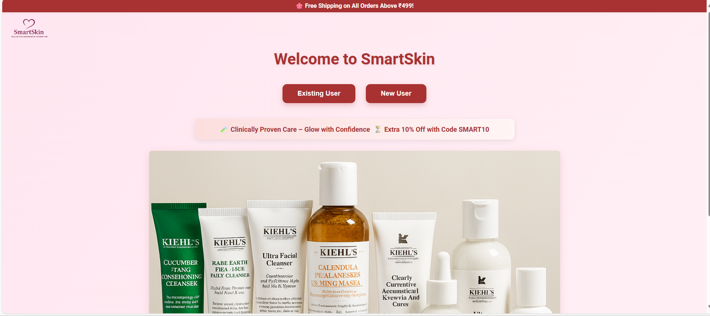
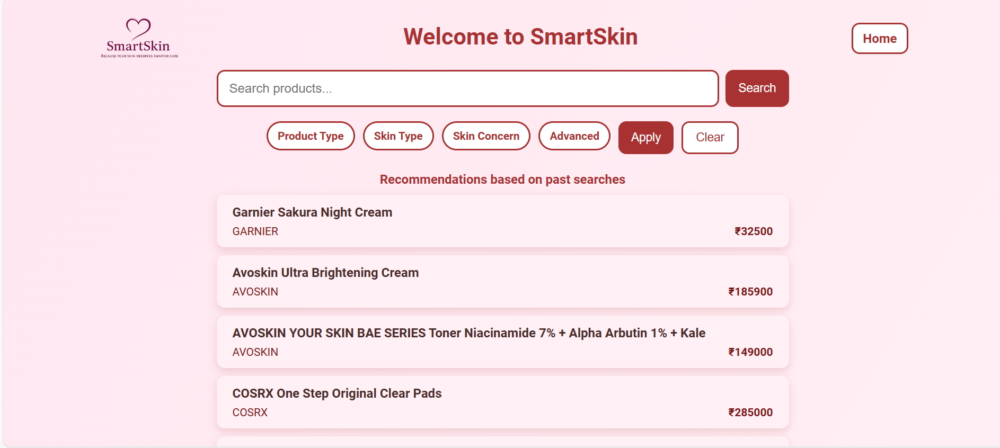
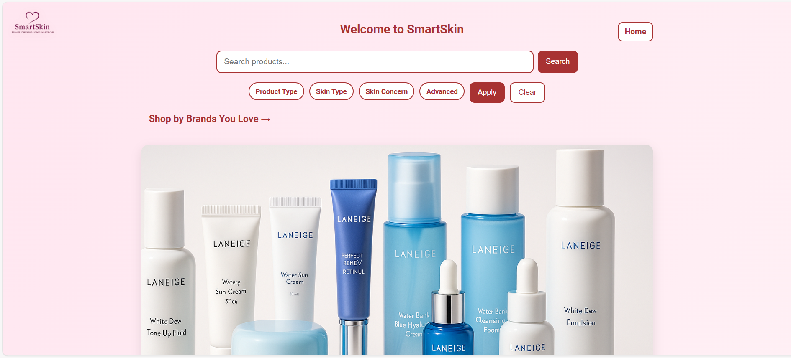
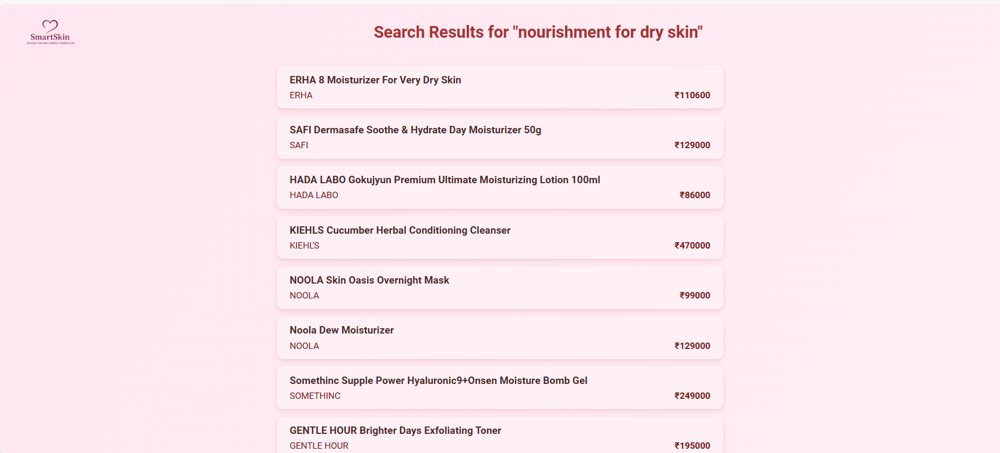
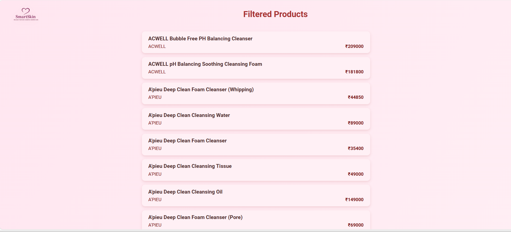
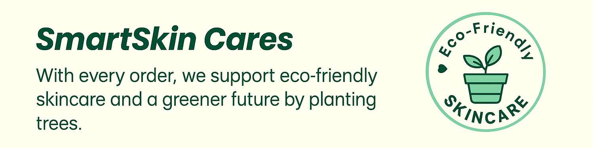

# SmartSkin – AI Powered Personalized Skincare Recommendation System 🌸

  <b>  SmartSkin: Because your skin deserves smarter care 💕</b>

   

---

## 📖 About This Project

**SmartSkin** is an AI-powered personalized skincare recommendation system designed to provide users with tailored product suggestions and skincare routines.  
It leverages **synthetic data generation**, **collaborative filtering**, **semantic search**, and **AI models** to recommend skincare products based on individual preferences, concerns, and skin profiles.

This project integrates an intuitive **web-based user interface** that allows users to interact with the system, explore personalized skincare routines, and receive intelligent suggestions.  
It is built with a combination of **machine learning**, **content-based filtering**, **collaborative filtering**, **Semantic search** , **cosine similarity** approaches to ensure accurate, diverse, and reliable recommendations.

---

## ✨ Features

- 🧴 **Personalized Recommendations** – Suggests skincare products tailored to skin type and concern.  
- 🤖 **AI-Powered Suggestions** – Uses **collaborative filtering** and **semantic search** to improve accuracy.  
- 📊 **Synthetic Data Generation** – Creates realistic user-product interactions for model training.  
- 🔍 **Semantic Search** – Understands product descriptions and ingredients for smarter results.  
- 📂 **Interactive UI** – Clean, modern, and easy-to-use interface with eco-friendly design.  
- 🌿 **Eco-Friendly Concept** – Integrated with an eco-banner to promote sustainability.  

---

## 🛠️ Tech Stack

- **Frontend:** HTML, CSS, JavaScript  
- **Backend:** Python   
- **Machine Learning:** Scikit-learn 
- **Data Processing:** Pandas, NumPy  
- **AI Modules:** NLP, Collaborative Filtering, Semantic Search 

---

## 🔬 How it works

### 🔹 **Data Collection / Synthetic Data** 
- Real and synthetic skincare datasets are used.
- Created artificial user-product interaction data to train models.  
- Simulated preferences based on **skin types (oily, dry, combination, sensitive)** and product categories.  
- Increased dataset diversity for better generalization.

### 🔹 **Collaborative Filtering**
- Implemented **User-User** and **Item-Item filtering**.  
- Provides recommendations by finding similar users or products.  
- Example: If User A and User B have similar concerns, products liked by User A are suggested to User B.

### 🔹 **Semantic Search**
- Uses **NLP embeddings** to understand product descriptions.  
- Finds products with similar ingredients or benefits.  
- Example: If user searches for *hydrating cream*, it can suggest *hyaluronic acid moisturizer*.

### 🔹 **User Dashboard**  
   - Displays routine suggestions, skincare products, and eco-friendly options.

---

## 🚀 How It Helps

- 🌍 **For Users** – Find the **right skincare product faster**, without confusion. Provides dermatology-inspired guidance using **AI automation**.
- 🏢 **For Businesses** – Enhance product discovery, improve sales, and reduce returns.  
- 🧪 **For Researchers** – Provides a base project to study **AI in recommendation systems**.  

---

## 🛠️ Problems Overcome

- **Cold Start Problem** – Solved with **synthetic data** to simulate user preferences.  
- **Data Sparsity** – Addressed using hybrid filtering + semantic search.  
- **Search Irrelevance** – Improved with NLP embeddings for semantic similarity.  
- **Personalization Accuracy** – Achieved by combining collaborative and content-based methods.  

---

## 📸 Screenshots

### Homepage  

### loginpage

### existing user Results  

### new user 

### search results 

### filter results

### Eco Banner  

---

## 👨‍💻 Author

Developed with ❤️ by **Shraddha Chougule**  
https://github.com/shraddhachougule02